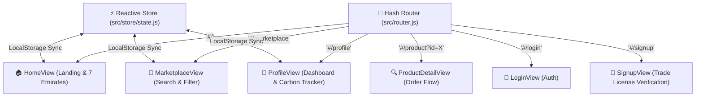

# ♻️ Re-Source - B2B Surplus Marketplace

[](https://MOHAMMED-SIRAJ-3373.github.io/re-source/)
[](https://github.com/MOHAMMED-SIRAJ-3373/re-source/actions/workflows/deploy-pages.yml)
[](LICENSE)
[](https://github.com/MOHAMMED-SIRAJ-3373/re-source)
[](https://github.com/MOHAMMED-SIRAJ-3373/re-source)

> **Re-Source** is a B2B surplus inventory marketplace built specifically for the United Arab Emirates (UAE). The platform connects verified enterprises, contractors, and suppliers across all seven Emirates to trade excess materials, machinery, IT hardware, and equipment - driving cost efficiency and advancing the circular economy in alignment with **UAE Vision 2031**.

👉 **Live URL**: [https://MOHAMMED-SIRAJ-3373.github.io/re-source/](https://MOHAMMED-SIRAJ-3373.github.io/re-source/)

---

## 🚀 How Automatic GitHub Pages Deployment Works

This repository is configured with an automated **GitHub Actions CI/CD Pipeline** ([`.github/workflows/deploy-pages.yml`](.github/workflows/deploy-pages.yml)).

Whenever you or a contributor push code to the `main` or `master` branch:
1. **GitHub automatically triggers a cloud build**.
2. It executes `npm install` and `npm run build` using Vite.
3. It deploys the compiled `dist/` directory directly to GitHub Pages.

---

### ⚙️ One-Time Setup on GitHub (1 Minute)

To activate automatic publishing for your repository:

1. Open your repository on GitHub: [`https://github.com/MOHAMMED-SIRAJ-3373/re-source`](https://github.com/MOHAMMED-SIRAJ-3373/re-source)
2. Go to **Settings** $\rightarrow$ **Pages** (in the left sidebar).
3. Under **Build and deployment** $\rightarrow$ **Source**, select **GitHub Actions**.
4. That's it! GitHub will handle all future deployments automatically on every commit.

---

## 🌟 Application Features & Architecture

**Re-Source** is built as a modular **Single Page Application (SPA)** powered by **Vite**, **ES Modules**, and a zero-dependency **Hash Router** that guarantees zero 404 errors on GitHub Pages static servers.



### 📄 Key Features Breakdown

- 🇦🇪 **7-Emirates Localization**: Built-in support for Dubai, Abu Dhabi, Sharjah, Ajman, Ras Al Khaimah, Fujairah, and Umm Al Quwain.
- 🌿 **ESG Carbon Impact Tracker**: Real-time visual monitoring of CO₂ emissions saved through industrial surplus reuse (2.3t CO₂ baseline).
- 🛡️ **B2B Trade License Verification**: Requires PDF/Image trade license uploads during signup to ensure enterprise-only trading.
- 🔍 **Multi-Parameter Search & Sort**: Real-time keyword search, category filter (9 categories), and price sorting (Low $\leftrightarrow$ High).
- ➕ **Dynamic Inventory Manager**: Allows sellers to post new surplus inventory via an interactive modal with instant `localStorage` persistence.
- 🌓 **Theme Customization**: Light & Dark theme toggle with local storage memory.
- 🔔 **Toast Notification System**: Native micro-interaction alerts replacing browser alert dialogs.

---

## 📂 Repository Directory Layout

```text
re-source/
├── .github/
│   └── workflows/
│       └── deploy-pages.yml    # GitHub Actions workflow for automatic deployment
├── public/                     # Static public assets (images, logos)
│   ├── logo1.png
│   ├── build.jpg
│   ├── construction.jpg
│   ├── fast.jpg
│   ├── login.jpg
│   ├── signup.jpg
│   └── verified.jpg
├── src/                        # Modular application source code
│   ├── components/             # Reusable UI components
│   │   ├── CarbonTracker.js    # ESG emissions widget
│   │   ├── Footer.js           # Site footer
│   │   ├── ListingModal.js     # Post new item modal dialog
│   │   ├── Navbar.js           # Header navigation & theme toggle
│   │   ├── ProductCard.js      # Marketplace item card
│   │   └── Toast.js            # Toast notification utility
│   ├── css/
│   │   └── main.css            # Central design system tokens & theme styles
│   ├── store/
│   │   └── state.js            # Central reactive store & localStorage manager
│   ├── views/                  # Page Views
│   │   ├── HomeView.js         # Landing page
│   │   ├── LoginView.js        # Authentication page
│   │   ├── MarketplaceView.js  # Catalog search & filter page
│   │   ├── ProductDetailView.js# Item inspection & checkout page
│   │   ├── ProfileView.js      # Company dashboard & listings manager
│   │   └── SignupView.js       # Business registration & Trade License form
│   ├── main.js                 # App entry point & router mounting
│   └── router.js               # Hash SPA router (GitHub Pages compatible)
├── .gitignore
├── index.html                  # SPA HTML entry point template
├── package.json                # Project dependencies and npm scripts
├── vite.config.js              # Vite build configuration (base: './')
└── README.md
```

## 📄 License

This project is open-source and licensed under the **GNU General Public License v3.0** — see the [LICENSE](LICENSE) file for details.
